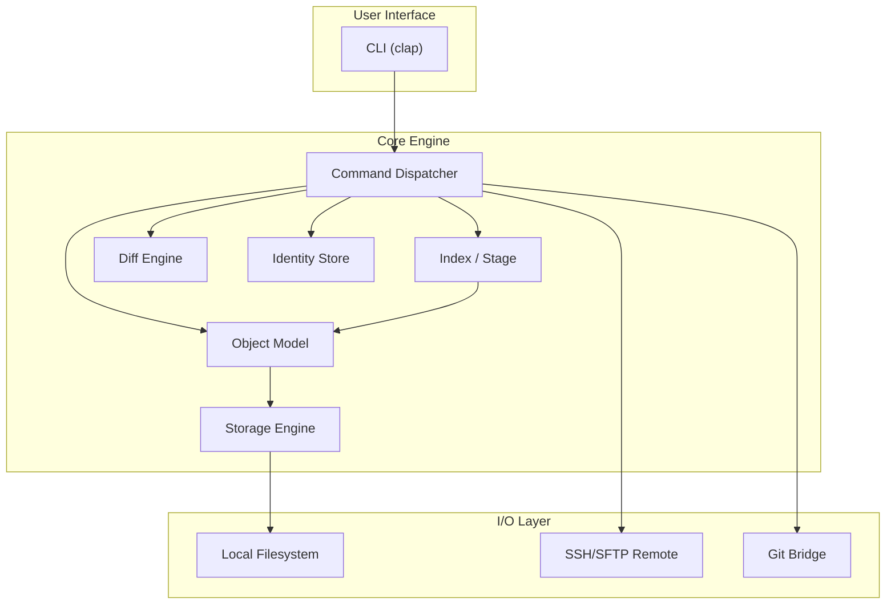
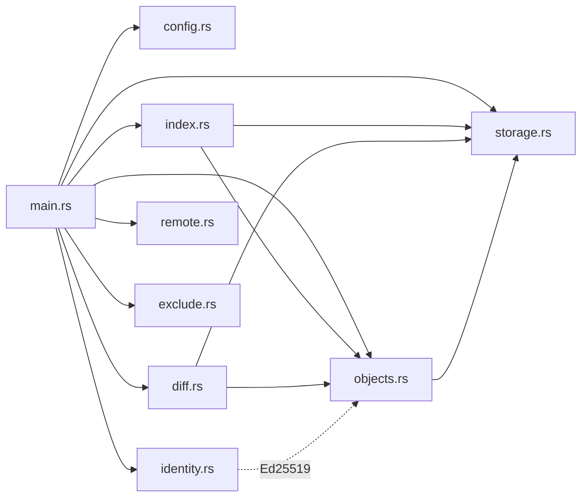
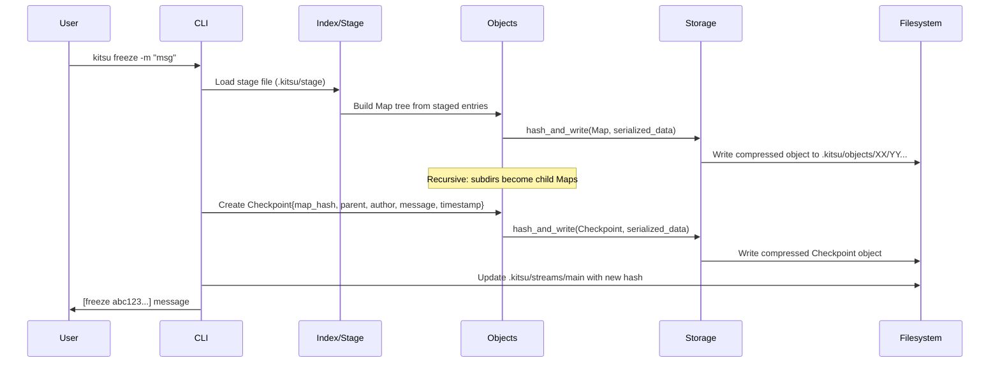
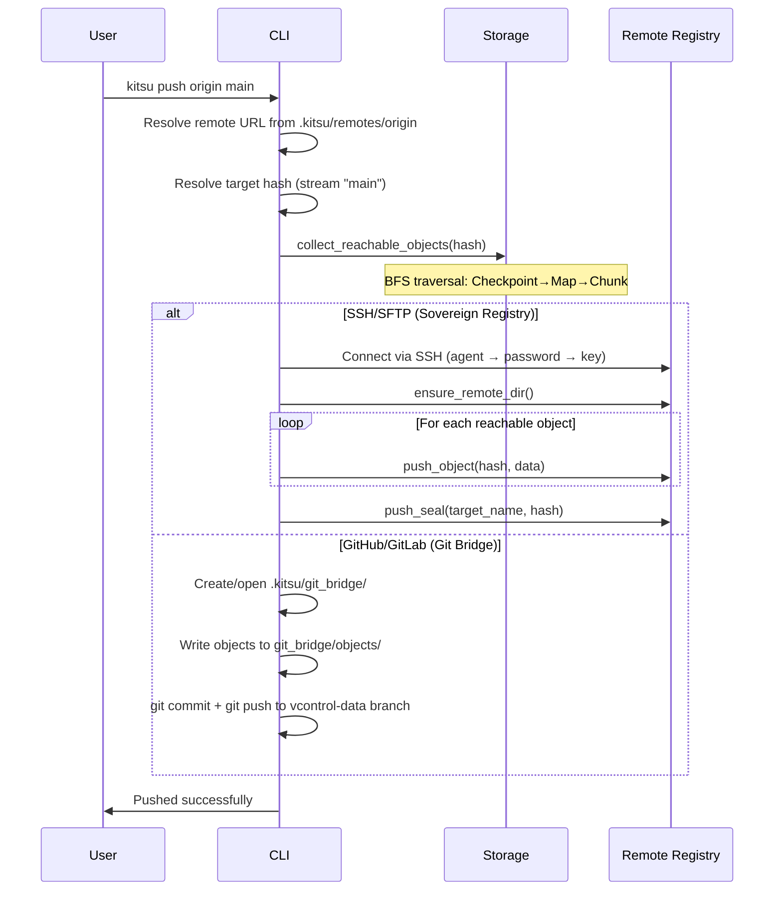

# Architecture

This document describes the high-level architecture of Kitsu, its data flow pipelines, module relationships, and key design decisions.

---

## System Overview

Kitsu is a **monolithic CLI application** structured as a set of Rust modules orchestrated by a central command dispatcher (`main.rs`). It follows a **content-addressable storage** paradigm where every piece of data is identified by its SHA-256 hash.

---

## Module Dependency Graph

All modules are compiled into a single binary. There is no library crate — `main.rs` declares `mod` for each module and serves as both the entry point and the primary orchestrator.

---

## Data Flow: The Freeze Pipeline

When a user runs `kitsu freeze -m "message"`, the following pipeline executes:

### Step-by-step breakdown:

1. **Load Stage** — Read the binary staging file (`.kitsu/stage`) into a `BTreeMap<String, StageEntry>`
2. **Build Map Tree** — Group entries by directory separator. For each subdirectory, recursively create a child `Map` object. Root-level files become direct `MapEntry` entries
3. **Write Map** — Serialize the Map (sorted alphabetically), hash with SHA-256, compress with zlib, write to `.kitsu/objects/`
4. **Create Checkpoint** — Assemble a `Checkpoint` struct with the Map hash, parent checkpoint hash, author info, timestamp, and commit message
5. **Optional Signing** — If `-S` flag is present, sign the serialized checkpoint data with the active persona's Ed25519 private key
6. **Write Checkpoint** — Serialize, hash, compress, write the Checkpoint object
7. **Update HEAD** — Write the new checkpoint hash to the current stream file (e.g., `.kitsu/streams/main`)

---

## Data Flow: The Push Pipeline

### Reachable Object Collection

The `collect_reachable_objects` function performs a **depth-first traversal** of the object graph:

1. Start from the target Checkpoint hash
2. Follow `Checkpoint.map_hash` → Map
3. For each `MapEntry` in the Map:
   - If mode `40000` (directory) → recurse into child Map
   - Otherwise → leaf Chunk (no children to follow)
4. Track visited hashes in a `HashSet` to avoid duplicates

---

## Target Resolution System

Kitsu supports multiple ways to reference a checkpoint:

| Syntax | Type | Example | Resolution |
|--------|------|---------|------------|
| `abc123...` | Direct hash | Full SHA-256 | Used as-is |
| `main` | Stream name | Branch reference | Read `.kitsu/streams/main` |
| `1.0.0` | Seal name | Semantic version tag | Read `.kitsu/seals/1.0.0` |
| `~N` | Relative | `~3` = 3 parents back | Walk parent chain N times from HEAD |
| `#N` | Absolute index | `#0` = first ever | Reverse history, index from oldest |

The `resolve_target()` function checks in order: **stream** → **seal** → **`~N` relative** → **`#N` absolute** → **raw hash**.

---

## Design Decisions

### Why not a DAG with merges?

Kitsu currently implements a **linear history model**. Each checkpoint has at most one parent. This simplifies the internal data model and avoids the complexity of three-way merges and conflict resolution. Merge support is planned for a future version.

### Custom terminology

Kitsu deliberately avoids Git's terminology to create a distinct identity:

- **Freeze** instead of Commit — emphasizes the immutable snapshot nature
- **Stream** instead of Branch — conveys a flowing timeline
- **Seal** instead of Tag — suggests a locked, official version
- **Checkpoint** instead of Commit object — clearer about what it represents
- **Map** instead of Tree — more intuitive for directory structure

See the [Glossary](glossary.md) for the complete mapping.

### Sovereign vs. Centralized

Kitsu is designed with **data sovereignty** in mind. The Sovereign Registry (SSH/SFTP) allows users to host their own object store on any server with SSH access, without depending on GitHub or any third party. The Git Bridge exists as a convenience layer for teams already using GitHub.

### Content-Addressable Storage

Like Git, Kitsu uses CAS to achieve:
- **Deduplication** — Identical content is stored only once
- **Integrity** — Any corruption is detectable via hash mismatch
- **Immutability** — Objects are never modified, only created
- **Efficient sync** — Only missing objects need to be transferred

### Build-time configuration

The `build.rs` script extracts `APP_NAME`, `DIR_NAME`, and `ABOUT` from `Cargo.toml` at compile time. This allows the binary to be configured (e.g., the `.kitsu` directory name) without runtime config files. The `[package.metadata.kitsu]` section in `Cargo.toml` serves as the single source of truth.
