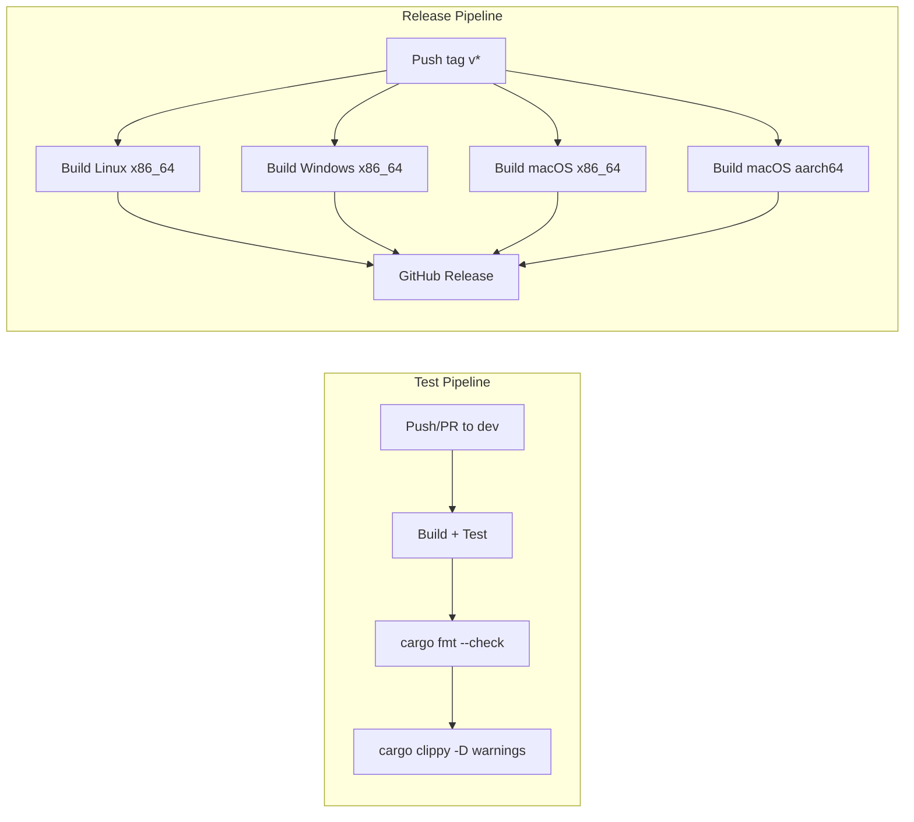

# CI/CD Pipelines

Kitsu uses **GitHub Actions** for continuous integration and automated release builds.

---

## Pipeline Overview



---

## Test Pipeline

**File:** `.github/workflows/test.yml`

### Trigger

```yaml
on:
  push:
    branches: "dev"
  pull_request:
    branches: "dev"
```

Runs on every push to `dev` and on pull requests targeting `dev`.

### Matrix

| OS | Runner |
|----|--------|
| Ubuntu | `ubuntu-latest` |
| Windows | `windows-latest` |
| macOS | `macos-latest` |

### Steps

#### 1. Checkout

```yaml
- uses: actions/checkout@v4
```

#### 2. Install System Dependencies

**Linux:**
```bash
sudo apt-get update
sudo apt-get install -y libssh2-1-dev libssl-dev pkg-config
```

**macOS:**
```bash
brew update
brew install libssh2 openssl pkg-config
```

**Windows:** No additional dependencies needed — `ssh2` crate uses bundled libraries.

#### 3. Setup Rust

```yaml
- uses: dtolnay/rust-toolchain@stable
  with:
    components: clippy, rustfmt
```

Installs the stable Rust toolchain with `clippy` and `rustfmt` components.

#### 4. Cache

```yaml
- uses: Swatinem/rust-cache@v2
```

Caches `~/.cargo` and `target/` to speed up subsequent builds.

#### 5. Build

```bash
cargo build --verbose
```

#### 6. Test

```bash
cargo test --verbose
```

Runs all unit tests (currently in `objects.rs` and `storage.rs`).

#### 7. Format Check

```bash
cargo fmt --all -- --check
```

Fails if any file doesn't match `rustfmt` formatting. This is a **non-modifying** check — it only reports, doesn't fix.

#### 8. Lint

```bash
cargo clippy -- -D warnings
```

Runs Clippy with **strict mode** — all warnings are treated as errors. This ensures the codebase stays clean.

---

## Production Release Pipeline

**File:** `.github/workflows/production.yml`

### Trigger

```yaml
on:
  push:
    tags:
      - 'v*'
```

Runs when a Git tag matching `v*` is pushed (e.g., `v0.0.1-alpha`, `v1.0.0`).

### Permissions

```yaml
permissions:
  contents: write
```

Required for creating GitHub Releases and uploading assets.

### Build Job

#### Matrix

| OS | Target | Binary Name | Archive Format |
|----|--------|-------------|----------------|
| `ubuntu-latest` | `x86_64-unknown-linux-gnu` | `kitsu` | `.tar.gz` |
| `windows-latest` | `x86_64-pc-windows-msvc` | `kitsu.exe` | `.zip` |
| `macos-latest` | `x86_64-apple-darwin` | `kitsu-intel` | `.tar.gz` |
| `macos-latest` | `aarch64-apple-darwin` | `kitsu-m1` | `.tar.gz` |

The matrix uses `fail-fast: false` so a failure on one platform doesn't cancel the others.

#### Steps

##### 1. Install Dependencies

Same as the test pipeline (libssh2, openssl for Linux/macOS).

##### 2. Setup Rust with Target

```yaml
- uses: dtolnay/rust-toolchain@stable
  with:
    targets: ${{ matrix.target }}
```

Installs the cross-compilation target if needed (e.g., `aarch64-apple-darwin`).

##### 3. Build Release Binary

```bash
cargo build --release --target ${{ matrix.target }}
```

##### 4. Rename Binary (Unix)

```bash
mv target/<target>/release/kitsu target/<target>/release/<binary_name>
```

Renames `kitsu` to the platform-specific name (e.g., `kitsu-intel`, `kitsu-m1`).

##### 5. Archive (Unix)

```bash
tar -czf kitsu-<target>.tar.gz <binary_name>
```

##### 6. Archive (Windows)

```bash
7z a kitsu-<target>.zip <binary_name>
```

##### 7. Upload Artifacts

```yaml
- uses: actions/upload-artifact@v4
  with:
    name: kitsu-${{ matrix.target }}
    path: kitsu-${{ matrix.target }}.*
```

### Release Job

Runs after all build jobs complete.

#### Steps

##### 1. Download Artifacts

```yaml
- uses: actions/download-artifact@v4
  with:
    path: artifacts
    pattern: kitsu-*
    merge-multiple: true
```

Downloads all platform artifacts into a single `artifacts/` directory.

##### 2. Create GitHub Release

```yaml
- uses: softprops/action-gh-release@v2
  with:
    files: artifacts/kitsu-*
    generate_release_notes: true
    draft: false
    prerelease: false
```

Creates a public GitHub Release with:
- Auto-generated release notes (from commits since last tag)
- All platform binaries as downloadable assets
- Not marked as draft or prerelease

---

## Release Artifacts

After a successful release, users can download:

| File | Platform | Contents |
|------|----------|----------|
| `kitsu-x86_64-unknown-linux-gnu.tar.gz` | Linux (x86_64) | `kitsu` binary |
| `kitsu-x86_64-pc-windows-msvc.zip` | Windows (x86_64) | `kitsu.exe` binary |
| `kitsu-x86_64-apple-darwin.tar.gz` | macOS (Intel) | `kitsu-intel` binary |
| `kitsu-aarch64-apple-darwin.tar.gz` | macOS (Apple Silicon) | `kitsu-m1` binary |

---

## Creating a Release

To create a new release:

```bash
# 1. Ensure all changes are committed and pushed
git push origin dev

# 2. Create and push a version tag
git tag v0.0.1-alpha
git push origin v0.0.1-alpha

# 3. The production pipeline will automatically:
#    - Build for all 4 platforms
#    - Create a GitHub Release
#    - Attach all binaries
```

---

## Environment Variables

| Variable | Scope | Value | Purpose |
|----------|-------|-------|---------|
| `CARGO_TERM_COLOR` | Both pipelines | `always` | Force colored Cargo output in CI logs |
