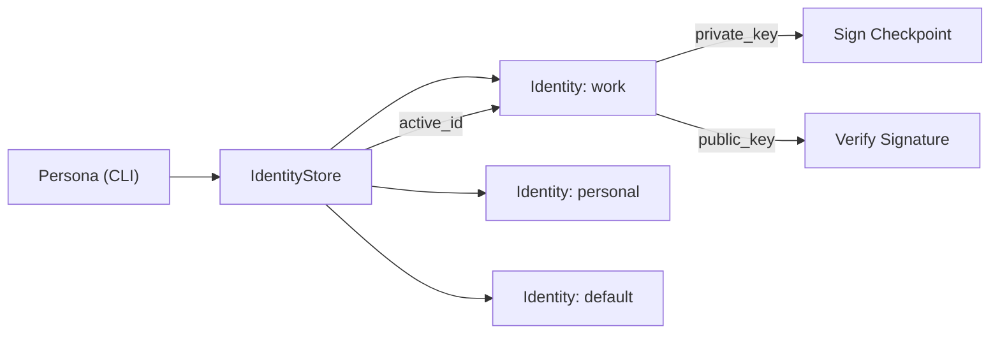
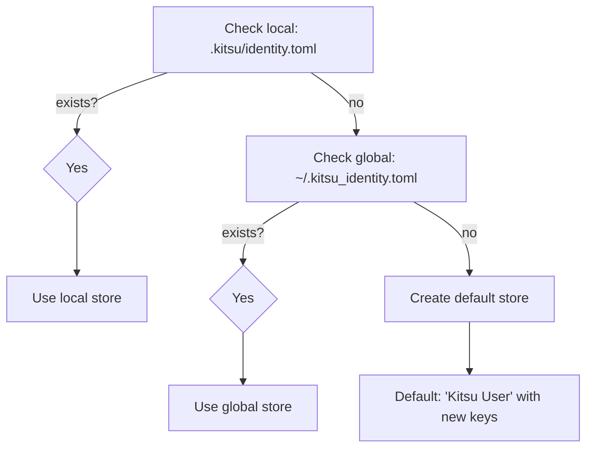
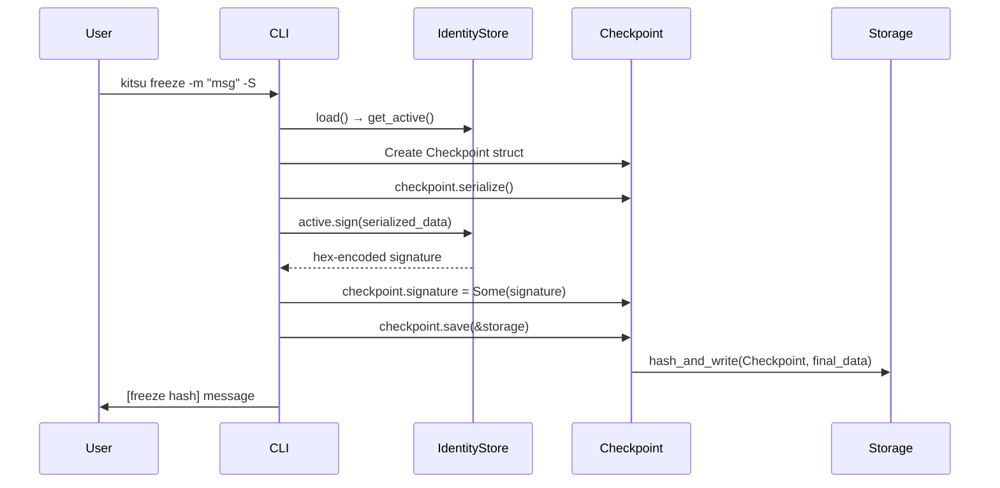

# Identity & Cryptography

Kitsu includes a built-in identity system with Ed25519 cryptographic key pairs for checkpoint signing and verification.

**Source:** `src/identity.rs` (116 lines)

---

## Overview



Each Kitsu user can maintain multiple **personas** (identities), each with:
- A unique `id` (string identifier)
- Display `name` and `email`
- An Ed25519 key pair (public + private key)

One persona is always **active** and is used as the author for new checkpoints.

---

## Identity Struct

```rust
#[derive(Serialize, Deserialize, Debug, Clone)]
pub struct Identity {
    pub id: String,                    // Unique identifier (e.g., "work", "personal")
    pub name: String,                  // Display name (e.g., "John Doe")
    pub email: String,                 // Email address
    pub public_key: Option<Vec<u8>>,   // Ed25519 verifying key (32 bytes)
    pub private_key: Option<Vec<u8>>,  // Ed25519 signing key (32 bytes)
}
```

### Key Generation

```rust
pub fn generate_keys(&mut self) {
    let mut csprng = OsRng;
    let signing_key = SigningKey::generate(&mut csprng);
    let verifying_key = signing_key.verifying_key();
    self.private_key = Some(signing_key.to_bytes().to_vec());
    self.public_key = Some(verifying_key.to_bytes().to_vec());
}
```

- Uses `OsRng` (operating system's CSPRNG) for secure randomness
- Ed25519 key pair generated via the `ed25519-dalek` crate
- Private key: 32 bytes (stored as `Vec<u8>`)
- Public key: 32 bytes (derived from private key)
- Keys are automatically generated when a persona is created via `persona add`

### Signing

```rust
pub fn sign(&self, data: &[u8]) -> Result<String>
```

1. Retrieves the private key bytes
2. Reconstructs the `SigningKey` from the 32-byte array
3. Signs the provided data using Ed25519
4. Returns the signature as a **hex-encoded string** (128 hex chars = 64 bytes)

**Used by:** `kitsu freeze -S` to sign the serialized checkpoint data.

### Verification

```rust
pub fn verify(
    public_key_bytes: &[u8],
    data: &[u8],
    signature_hex: &str,
) -> Result<bool>
```

1. Hex-decodes the signature string back to 64 bytes
2. Reconstructs the `VerifyingKey` from the public key bytes
3. Performs strict Ed25519 verification
4. Returns `true` if valid, `false` otherwise

> **Note:** This function is currently marked `#[allow(dead_code)]` — it's implemented but not yet used in any command (signature verification during `timeline` display is not yet hooked up).

---

## Identity Store

```rust
#[derive(Serialize, Deserialize, Debug)]
pub struct IdentityStore {
    pub identities: Vec<Identity>,  // All configured personas
    pub active_id: String,          // ID of the currently active persona
}
```

### Loading Priority

The store is loaded with the following precedence:



1. **Local** — `.kitsu/identity.toml` (project-specific)
2. **Global** — `~/.kitsu_identity.toml` (user-wide, resolved via `dirs::home_dir()`)
3. **Default** — Creates a default identity named `"Kitsu User"` with `"kitsu@example.com"` and auto-generated keys

### Saving

```rust
pub fn save(&self, current_dir: &Path, global: bool) -> Result<()>
```

- `global: true` → Writes to `~/.kitsu_identity.toml`
- `global: false` → Writes to `.kitsu/identity.toml`

The store is serialized to TOML format using `serde` + `toml`.

### Getting the Active Identity

```rust
pub fn get_active(&self) -> &Identity
```

Finds the identity whose `id` matches `active_id`. Falls back to the first identity in the list if the active ID is not found.

---

## Storage Format

The identity store is persisted as a TOML file:

```toml
active_id = "work"

[[identities]]
id = "work"
name = "John Doe"
email = "john@company.com"
public_key = [/* 32 bytes */]
private_key = [/* 32 bytes */]

[[identities]]
id = "personal"
name = "John"
email = "john@home.com"
public_key = [/* 32 bytes */]
private_key = [/* 32 bytes */]
```

> **Security Note:** Private keys are stored in plaintext in the TOML file. For production use, consider encrypting the identity file or using OS-level keychain integration (not yet implemented).

---

## Checkpoint Signing Flow



**Important detail:** The signature covers the serialized checkpoint data **before** the signature line is added. This means:
1. The checkpoint is serialized without the signature field
2. The serialized data is signed
3. The signature is added to the checkpoint
4. The checkpoint is re-serialized (now with the signature) and saved

---

## Cryptographic Dependencies

| Crate | Version | Purpose |
|-------|---------|---------|
| `ed25519-dalek` | 2.2.0 | Ed25519 signing and verification |
| `rand_core` | 0.6 | `OsRng` for cryptographically secure random number generation |
| `rand` | 0.8 | Required by `ed25519-dalek` feature `rand_core` |
| `hex` | 0.4.3 | Encoding/decoding signatures as hex strings |

---

## CLI Persona Commands Summary

| Command | Description |
|---------|-------------|
| `kitsu persona` | Show active persona |
| `kitsu persona add <id> <name> <email> [-g]` | Create new persona with key pair |
| `kitsu persona list` | List all personas |
| `kitsu persona use <id> [-g]` | Switch active persona |
| `kitsu persona edit <id> [-n] [-e] [-g]` | Edit name/email |
| `kitsu persona github <username> [id] [-g]` | Set up from GitHub username |
| `kitsu persona keys` | Regenerate active persona's keys |

The `-g` / `--global` flag determines whether changes are saved to the local (`.kitsu/identity.toml`) or global (`~/.kitsu_identity.toml`) store.
