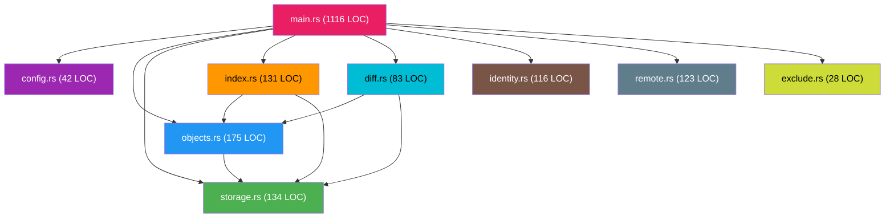

# Modules Reference

Detailed reference for each Rust source module in the Kitsu codebase.

---

## Module Overview



**Total:** 9 modules, ~1,848 lines of Rust code.

---

## `main.rs` — Command Dispatcher

**Lines:** 1,116 | **Role:** Entry point, CLI definition, command execution

### CLI Structs (clap derive)

| Struct | Type | Purpose |
|--------|------|---------|
| `Cli` | `Parser` | Root CLI with a single `Commands` subcommand |
| `Commands` | `Subcommand` | All top-level commands (Ignite, Track, Freeze, etc.) |
| `BumpType` | `ValueEnum` | Seal version bump type (Major, Minor, Patch) |
| `PersonaAction` | `Subcommand` | Persona management subcommands |
| `BeamAction` | `Subcommand` | Quick remote management subcommands |
| `RepoAction` | `Subcommand` | Repository management subcommands |
| `RemoteAction` | `Subcommand` | Remote CRUD subcommands |
| `StreamAction` | `Subcommand` | Stream management subcommands |

### Helper Functions

| Function | Signature | Purpose |
|----------|-----------|---------|
| `get_head_hash` | `(Path, AppConfig) → Option<String>` | Resolves CURRENT to a checkpoint hash |
| `resolve_target` | `(str, Path, AppConfig, Storage) → String` | Resolves any target reference to a hash |
| `apply_map_to_disk` | `(Storage, str, Path, Exclude) → ()` | Reconstructs working tree from a Map |
| `collect_reachable_objects` | `(Storage, str, HashSet) → ()` | DFS traversal to find all referenced objects |
| `get_default_remote` | `(Path) → String` | Reads `.kitsu/default_remote` or returns `"origin"` |
| `is_git_url` | `(str) → bool` | Checks if URL points to GitHub/GitLab |
| `connect_remote` | `(str) → Session` | Establishes SSH connection with fallback auth |

### Dependencies

```rust
use crate::config::AppConfig;
use crate::exclude::Exclude;
use crate::identity::IdentityStore;
use anyhow::Result;
use clap::{Parser, Subcommand};
use colored::*;
use dialoguer::{Confirm, Input, Select};
use semver::Version;
use ssh2::Session;
use std::{env, fs, io::Read, path::{Path, PathBuf}};
```

---

## `config.rs` — Configuration

**Lines:** 42 | **Role:** Build-time constants and runtime configuration

### Constants

| Constant | Value | Source |
|----------|-------|--------|
| `APP_NAME` | `"kitsu"` | `env!("APP_NAME")` from `build.rs` |
| `DIR_NAME` | `".kitsu"` | `env!("DIR_NAME")` from `build.rs` |
| `ABOUT` | `"A modern version control system writed in Rust"` | `env!("ABOUT")` from `build.rs` |
| `STAGE_FILE` | `"stage"` | Hardcoded |
| `CURRENT_FILE` | `"CURRENT"` | Hardcoded |
| `STREAMS_DIR` | `"streams"` | Hardcoded |
| `OBJECTS_DIR` | `"objects"` | Hardcoded |

### Structs

| Struct | Derives | Fields |
|--------|---------|--------|
| `AppConfig` | `Serialize, Deserialize, Debug, Clone` | `app_name`, `about`, `dir_name`, `stage_file`, `current_file`, `streams_dir`, `objects_dir` |

### Public API

| Method | Description |
|--------|-------------|
| `AppConfig::load()` | Returns `AppConfig::default()` (no runtime config loading yet) |
| `AppConfig::default()` | Populates all fields from compile-time constants |

---

## `objects.rs` — Object Model

**Lines:** 175 | **Role:** Data types for Chunk, Map, and Checkpoint

### Structs

#### `Chunk`

| Field | Type | Description |
|-------|------|-------------|
| `content` | `Vec<u8>` | Raw file bytes |

| Method | Returns | Description |
|--------|---------|-------------|
| `new(content)` | `Chunk` | Constructor |
| `save(storage)` | `Result<String>` | Hashes and writes to storage, returns hash |
| `hash()` | `String` | Computes SHA-256 hash without writing |

#### `MapEntry`

| Field | Type | Description |
|-------|------|-------------|
| `mode` | `String` | `"100644"` or `"40000"` |
| `name` | `String` | File or directory name |
| `hash` | `String` | SHA-256 hash of referenced object |

#### `Map`

| Field | Type | Description |
|-------|------|-------------|
| `entries` | `Vec<MapEntry>` | Ordered list of directory entries |

| Method | Returns | Description |
|--------|---------|-------------|
| `new(entries)` | `Map` | Constructor |
| `serialize()` | `Vec<u8>` | Binary serialization (sorted by name) |
| `save(storage)` | `Result<String>` | Serializes and writes to storage |
| `deserialize(data)` | `Result<Map>` | Parses binary data back into a Map |

#### `Checkpoint`

| Field | Type | Description |
|-------|------|-------------|
| `map_hash` | `String` | Root Map hash |
| `parent_hash` | `Option<String>` | Previous checkpoint |
| `author` | `String` | `"Name <email>"` |
| `message` | `String` | Checkpoint message |
| `timestamp` | `i64` | Unix timestamp |
| `signature` | `Option<String>` | Ed25519 signature hex |

| Method | Returns | Description |
|--------|---------|-------------|
| `serialize()` | `Vec<u8>` | Text format serialization |
| `save(storage)` | `Result<String>` | Serializes and writes to storage |
| `deserialize(data)` | `Result<Checkpoint>` | Parses text data back into a Checkpoint |

### Tests

| Test | Description |
|------|-------------|
| `test_chunk_hashing` | Verifies hash output is 64 hex chars |
| `test_map_serialization` | Round-trip serialize/deserialize of a Map |

---

## `storage.rs` — Storage Engine

**Lines:** 134 | **Role:** Content-addressable object storage with compression

### Enums

#### `ObjectType`

| Variant | String | Description |
|---------|--------|-------------|
| `Chunk` | `"chunk"` | Raw file content |
| `Map` | `"map"` | Directory tree |
| `Checkpoint` | `"checkpoint"` | Snapshot metadata |

### Structs

#### `Storage`

| Field | Type | Description |
|-------|------|-------------|
| `root_dir` | `PathBuf` | Project root |
| `config` | `AppConfig` | Runtime configuration |

### Public API

| Method | Signature | Description |
|--------|-----------|-------------|
| `new` | `(PathBuf, AppConfig) → Storage` | Constructor |
| `get_object_path` | `(&str) → PathBuf` | Hash to filesystem path |
| `hash_and_write` | `(ObjectType, &[u8]) → Result<String>` | Hash, compress, write, return hash |
| `read_object` | `(&str) → Result<(ObjectType, Vec<u8>)>` | Read, decompress, parse |
| `write_raw` | `(&str, &[u8]) → Result<(ObjectType, Vec<u8>)>` | Write pre-formatted data |

### External Dependencies

| Crate | Usage |
|-------|-------|
| `sha2` | SHA-256 hashing |
| `flate2` | Zlib compression/decompression |
| `hex` | Hash to hex string conversion |

### Tests

| Test | Description |
|------|-------------|
| `test_storage_write_read` | Round-trip write and read of a Chunk in a temp directory |

---

## `index.rs` — Staging Area

**Lines:** 131 | **Role:** Binary staging file management and Map tree construction

### Structs

#### `StageEntry`

| Field | Type | Description |
|-------|------|-------------|
| `hash` | `String` | Object hash |
| `path` | `String` | Relative file path |
| `mode` | `u32` | File mode (`0o100644` or `0o40000`) |
| `size` | `u64` | File size in bytes |

#### `Stage`

| Field | Type | Description |
|-------|------|-------------|
| `entries` | `BTreeMap<String, StageEntry>` | Path → entry mapping (sorted) |
| `path` | `PathBuf` | Path to the stage file |
| `config` | `AppConfig` | Runtime configuration |

### Public API

| Method | Description |
|--------|-------------|
| `load(root_dir, config)` | Parse binary stage file into memory |
| `add(path, hash, mode, size)` | Insert/update a staging entry |
| `save()` | Serialize and write binary stage file |
| `write_map(storage)` | Convert flat entries into hierarchical Map tree, returns root Map hash |

### Internal Dependencies

| Module | Usage |
|--------|-------|
| `config` | `AppConfig` for directory paths |
| `objects` | `Map`, `MapEntry` for tree construction |
| `storage` | `Storage` for writing Map objects |

---

## `diff.rs` — Diff Engine

**Lines:** 83 | **Role:** Recursive Map comparison with colorized output

### Public Functions

| Function | Signature | Description |
|----------|-----------|-------------|
| `diff_maps` | `(Storage, Option<&str>, &str, &str) → Result<()>` | Recursively compare two Map trees |

### Private Functions

| Function | Signature | Description |
|----------|-----------|-------------|
| `print_diff` | `(&[u8], &[u8]) → ()` | Line-level diff with colored output |

### Algorithm

1. Deserialize both Maps into `BTreeMap<name, entry>` for O(1) lookup
2. Compute the union of all entry names
3. For each name:
   - **Both exist, same hash** → Skip (unchanged)
   - **Both exist, different hash, both dirs** → Recurse into subdirectory Maps
   - **Both exist, different hash, files** → Print line-level diff
   - **Only in old** → Print `"deleted file:"`
   - **Only in new** → Print `"new file:"` with full diff
4. Line-level diff uses the `similar` crate's `TextDiff::from_lines()`
5. Output colors: red for deletions (`-`), green for insertions (`+`), white for context

### External Dependencies

| Crate | Usage |
|-------|-------|
| `similar` | Line-level text diff algorithm |
| `colored` | ANSI color output |

---

## `identity.rs` — Identity Management

**Lines:** 116 | **Role:** Ed25519 persona management, signing, and verification

### Structs

| Struct | Description |
|--------|-------------|
| `Identity` | Single persona with name, email, and Ed25519 key pair |
| `IdentityStore` | Collection of personas with active selection |

### Public API (Identity)

| Method | Description |
|--------|-------------|
| `generate_keys()` | Generate new Ed25519 key pair using OsRng |
| `sign(data)` | Sign data with private key, return hex signature |
| `verify(pub_key, data, sig_hex)` | Verify signature (static method, currently unused) |

### Public API (IdentityStore)

| Method | Description |
|--------|-------------|
| `load(current_dir)` | Load from local → global → default |
| `save(current_dir, global)` | Save to local or global TOML file |
| `get_active()` | Get reference to the active Identity |

See [Identity & Cryptography](identity-and-crypto.md) for detailed documentation.

---

## `remote.rs` — Remote Operations

**Lines:** 123 | **Role:** SSH/SFTP client for object and seal transfer

### Structs

#### `Remote`

| Field | Type | Description |
|-------|------|-------------|
| `url` | `String` | Remote URL |

### Public API

| Method | Description |
|--------|-------------|
| `new(url)` | Constructor |
| `connect(password)` | Establish SSH session (agent → password → key) |
| `ensure_remote_dir(sess, path)` | Create remote directory structure |
| `push_object(sess, hash, data, path)` | Upload one object |
| `fetch_object(sess, hash, path)` | Download one object |
| `push_seal(sess, name, hash, path)` | Create/update a seal |
| `fetch_seal(sess, name, path)` | Read a seal hash |

See [Networking](networking.md) for detailed documentation.

---

## `exclude.rs` — Exclusion Patterns

**Lines:** 28 | **Role:** Gitignore-compatible file exclusion

### Structs

#### `Exclude`

| Field | Type | Description |
|-------|------|-------------|
| `gitignore` | `Gitignore` | Compiled gitignore matcher |

### Public API

| Method | Description |
|--------|-------------|
| `load(root_dir)` | Load `.exclude` file + built-in rules |
| `is_ignored(path, is_dir)` | Check if a path should be excluded |

### Built-in Rules

Added programmatically (not from `.exclude` file):

| Pattern | Reason |
|---------|--------|
| `DIR_NAME` (`.kitsu`) | Always ignore the VCS directory |
| `.git` | Ignore Git metadata |
| `target` | Ignore Rust build output |

### External Dependencies

| Crate | Usage |
|-------|-------|
| `ignore` | Gitignore pattern matching (`GitignoreBuilder`) |
