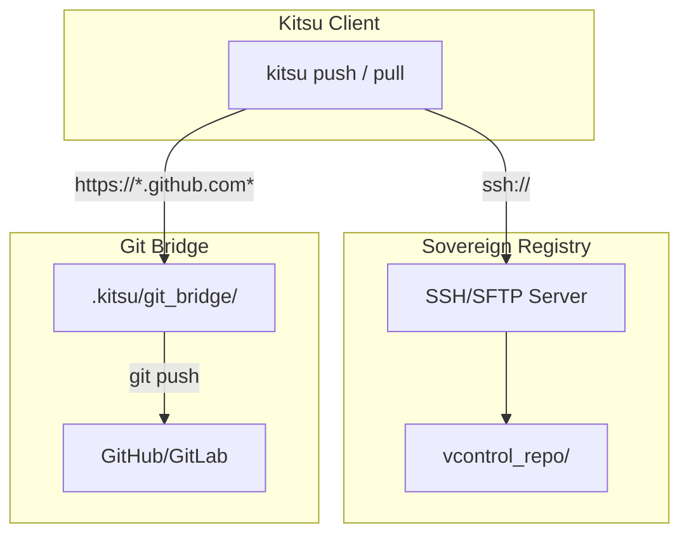
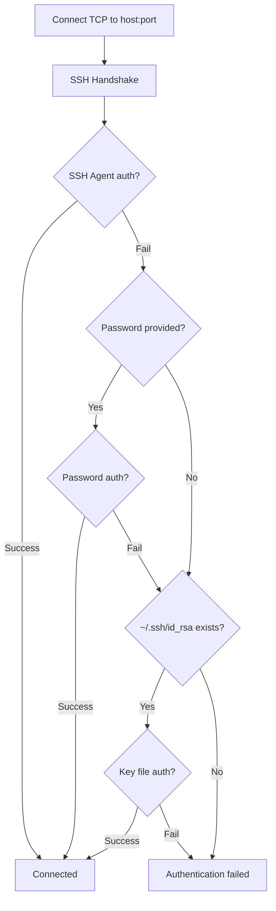
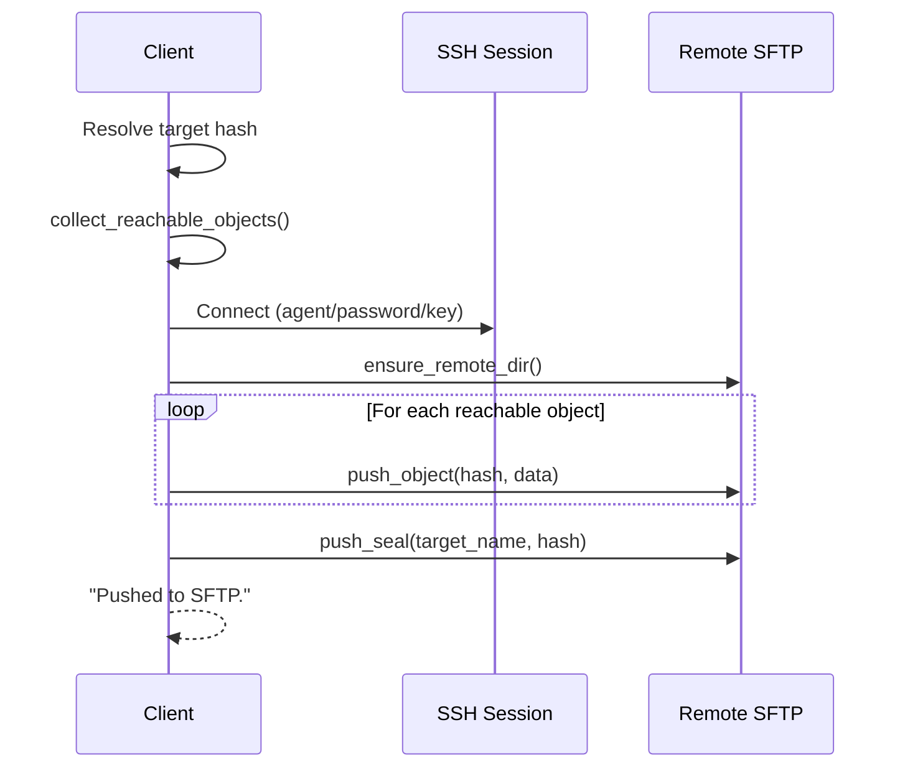
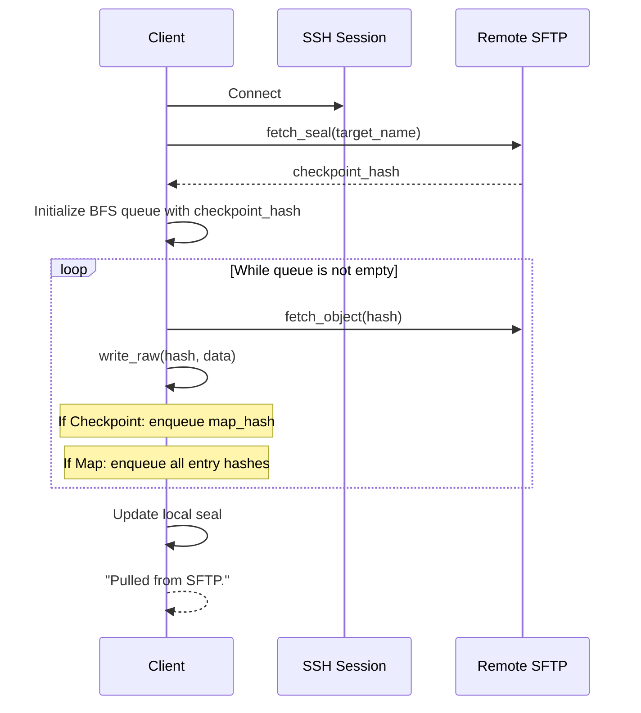
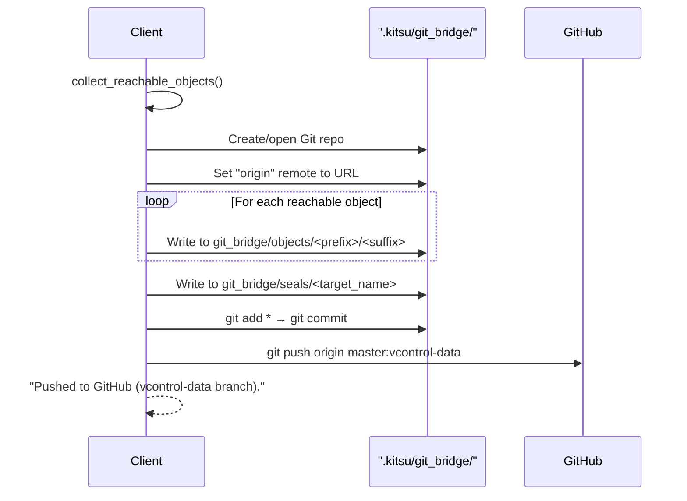

# Networking

Kitsu supports two remote registry backends for pushing and pulling objects: a **Sovereign Registry** (self-hosted via SSH/SFTP) and a **Git Bridge** (GitHub/GitLab integration).

**Source:** `src/remote.rs` (123 lines) + networking logic in `src/main.rs`

---

## Registry Types



### Detection

Kitsu determines which backend to use based on the remote URL:

```rust
fn is_git_url(url: &str) -> bool {
    url.contains("github.com") || url.contains("gitlab.com") || url.ends_with(".git")
}
```

- URLs containing `github.com`, `gitlab.com`, or ending in `.git` → **Git Bridge**
- Everything else → **Sovereign Registry** (SSH/SFTP)

---

## Sovereign Registry (SSH/SFTP)

The Sovereign Registry allows users to host their object store on **any server with SSH access**. No special server software is needed — just a filesystem accessible via SFTP.

### Remote URL Format

```
ssh://[user@]host[:port]/path
```

**Examples:**
```
ssh://root@myserver.com/opt/vcontrol/repo
ssh://deploy@192.168.1.100:2222/home/deploy/repos/myproject
ssh://server.local/var/repos/project
```

### URL Parsing

```
ssh://user@host:port/remote_path
       │     │    │     │
       │     │    │     └── Remote path on server (default: ".")
       │     │    └── Port (default: "22")
       │     └── Host
       └── Username (default: "root")
```

### Remote Directory Structure

Kitsu creates the following structure on the remote server:

```
vcontrol_repo/
├── objects/          ← Compressed object blobs
│   └── ab/
│       └── cdef...
├── seals/            ← Version tags (file content = checkpoint hash)
│   ├── latest
│   └── main
└── streams/          ← Branch pointers (reserved, not yet used remotely)
```

### Authentication Flow



Authentication is attempted in this order:

1. **SSH Agent** — `sess.userauth_agent(user)` (e.g., ssh-agent, Pageant)
2. **Password** — If provided (prompted interactively on first failure)
3. **Key file** — `~/.ssh/id_rsa` without passphrase

If all methods fail, the connection is aborted.

### Interactive Password Fallback

When SSH key authentication fails, the user is prompted:

```
SSH Key authentication failed.
? Try password authentication? Yes
Enter SSH Password: ********
```

This uses `dialoguer::Confirm` for the prompt and `rpassword::prompt_password` for hidden password input.

---

### Remote Operations

#### `ensure_remote_dir(sess, remote_path)`

Creates the required directory structure on the remote server:

```
remote_path/objects/
remote_path/seals/
remote_path/streams/
```

Uses `sftp.mkdir()` — errors are silently ignored (directories may already exist).

#### `push_object(sess, hash, data, remote_repo_path)`

Uploads a single object to the remote store:

1. Splits hash into `(dir, file)` = `(hash[0..2], hash[2..])`
2. Creates the prefix directory: `remote_path/objects/<dir>/`
3. Writes the raw data to: `remote_path/objects/<dir>/<file>`

> **Note:** Objects are pushed as **uncompressed** raw data (header + content), not the zlib-compressed version stored locally. The remote stores objects in their raw form.

#### `fetch_object(sess, hash, remote_repo_path)`

Downloads a single object from the remote store:

1. Constructs path: `remote_path/objects/<hash[0..2]>/<hash[2..]>`
2. Reads the file contents via SFTP
3. Returns the raw bytes

#### `push_seal(sess, name, hash, remote_repo_path)`

Creates or updates a seal on the remote:

1. Path: `remote_path/seals/<name>`
2. Content: the checkpoint hash as ASCII text

#### `fetch_seal(sess, name, remote_repo_path)`

Reads a seal from the remote:

1. Path: `remote_path/seals/<name>`
2. Returns the trimmed hash string

---

### Push Flow (Sovereign)



**All** reachable objects are pushed, even if they already exist remotely. There is no negotiation protocol to determine which objects the remote already has. This is a known limitation for the alpha version.

### Pull Flow (Sovereign)



Objects are fetched lazily via **breadth-first traversal** of the object graph. Already-stored objects are written again (idempotent due to CAS).

---

## Git Bridge

The Git Bridge allows pushing Kitsu objects to GitHub or GitLab by wrapping them in a standard Git repository.

### How It Works

1. A helper Git repository is created at `.kitsu/git_bridge/`
2. Kitsu objects are written as files inside this repo under `objects/` and `seals/`
3. A Git commit is created with all the objects
4. The commit is pushed to a branch called `vcontrol-data` on the remote

### Push Flow (Git Bridge)



### Git Bridge Limitations

- Uses the `git2` crate (libgit2 bindings), not the `git` CLI
- Pushes to a dedicated `vcontrol-data` branch to avoid conflicts with normal Git usage
- Git pull is **not yet implemented** (marked as WIP)
- Authentication relies on the system's Git credential configuration

---

## Remote Configuration

### Remote Storage

Remotes are stored as simple files:

```
.kitsu/remotes/
├── origin          ← Content: "ssh://root@server.com/opt/vcontrol/repo"
└── backup          ← Content: "https://github.com/user/repo.git"
```

Each file's name is the remote name, and its content is the URL.

### Default Remote

```
.kitsu/default_remote    ← Content: "origin"
```

If this file doesn't exist, `"origin"` is used as the default.

### Managing Remotes

Remotes can be managed via two command groups:

| Command | Description |
|---------|-------------|
| `kitsu repository remote add <name> <url>` | Add a remote |
| `kitsu repository remote edit <name> <url>` | Update URL |
| `kitsu repository remote default <name>` | Set default |
| `kitsu repository remote list` | List all |
| `kitsu repository remote remove <name>` | Delete |
| `kitsu beam add <name> <url>` | Add (shorthand) |
| `kitsu beam list` | List (shorthand) |
| `kitsu beam default <name>` | Set default (shorthand) |

---

## Dependencies

| Crate | Version | Purpose |
|-------|---------|---------|
| `ssh2` | 0.9.5 | SSH session management, SFTP file operations |
| `git2` | 0.20.4 | Git repository operations for the Git Bridge |
| `dirs` | 6.0.0 | Resolving `~/.ssh/id_rsa` for key-based auth |
| `rpassword` | 7.5.2 | Hidden password input for interactive auth |
| `dialoguer` | 0.12.0 | Interactive confirmation prompts |
