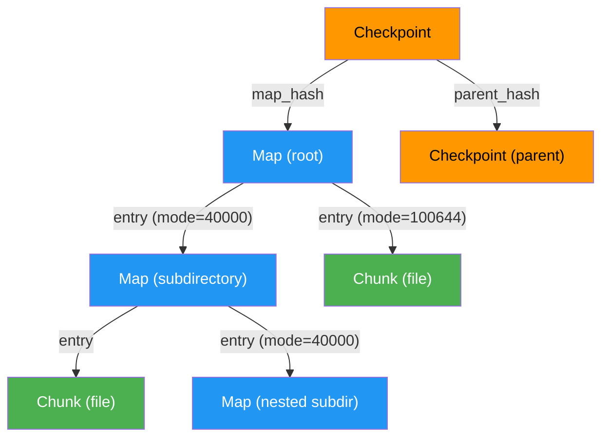
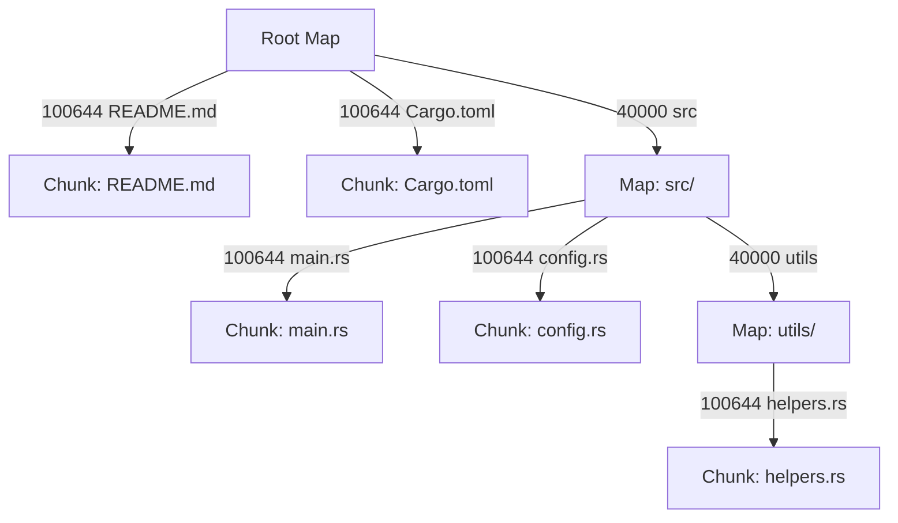
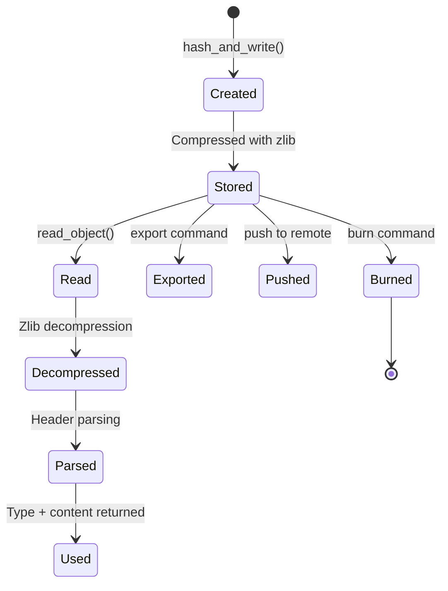

# Object Model

Kitsu stores all data as **content-addressable objects**. Every object is identified by the SHA-256 hash of its header + content, and is stored in compressed form on disk. There are three object types.

---

## Object Types



| Type | Color | Git Equivalent | Purpose |
|------|-------|----------------|---------|
| **Chunk** | 🟢 Green | Blob | Raw file content |
| **Map** | 🔵 Blue | Tree | Directory listing |
| **Checkpoint** | 🟠 Orange | Commit | Snapshot with metadata |

---

## Chunk

A **Chunk** is the simplest object type. It stores the raw bytes of a single file.

### Structure

```
┌──────────────────────────────────────────┐
│ Header: "chunk <content_length>\0"       │
│ Content: <raw file bytes>                │
└──────────────────────────────────────────┘
```

### Hashing

```rust
fn hash(&self) -> String {
    let mut hasher = Sha256::new();
    hasher.update(b"chunk ");
    hasher.update(content.len().to_string());
    hasher.update([0]);       // null byte separator
    hasher.update(&content);
    hex::encode(hasher.finalize())
}
```

The hash is computed over the **entire object** (header + content), not just the content. This means the same file content always produces the same hash, enabling deduplication.

### Storage

When saved via `Chunk::save()`:
1. The full object (header + content) is hashed with SHA-256
2. The full object is compressed with zlib
3. The compressed data is written to `.kitsu/objects/<hash[0..2]>/<hash[2..]>`

### Example

For a file containing `hello kitsu`:
```
Raw object:    "chunk 11\0hello kitsu"
SHA-256 hash:  (64 hex characters)
On disk:       zlib compressed version of the raw object
```

---

## Map

A **Map** represents a directory. It contains an ordered list of entries, each pointing to either a Chunk (file) or another Map (subdirectory).

### Entry Structure

```rust
pub struct MapEntry {
    pub mode: String,   // "100644" (file) or "40000" (directory)
    pub name: String,   // filename or directory name
    pub hash: String,   // SHA-256 hash of the referenced object
}
```

### Binary Format

Entries are serialized as a binary sequence, sorted alphabetically by name:

```
┌────────────────────────────────────────────────┐
│ For each entry:                                │
│   "<mode> <name>\0"         (ASCII + null)     │
│   <32 bytes>                (raw hash bytes)   │
│                                                │
│ Repeated for all entries...                    │
└────────────────────────────────────────────────┘
```

> **Important:** The hash is stored as **raw 32 bytes** (not hex-encoded) in the binary format. It is hex-decoded during serialization and hex-encoded during deserialization.

### Mode Values

| Mode | Meaning | Description |
|------|---------|-------------|
| `100644` | Regular file | Points to a Chunk object |
| `40000` | Directory | Points to another Map object |

### Serialization Example

For a directory containing `README.md` and `src/`:

```
Sorted entries: ["README.md", "src"]

Binary output:
  "100644 README.md\0" + <32 bytes of README's chunk hash>
  "40000 src\0" + <32 bytes of src's map hash>
```

### Tree Construction

When building a Map from the staging area (`Stage::write_map()`), the process is recursive:



1. Group staged entries by their first path component
2. Entries with no path separator → direct root entries
3. Entries with path separators → grouped into subdirectory Maps
4. Recursively build child Maps for each subdirectory
5. Each Map is saved to storage and its hash becomes a `MapEntry` in the parent

---

## Checkpoint

A **Checkpoint** is the top-level snapshot object. It references a root Map (the entire file tree at that point) and contains metadata about who created it and when.

### Structure

```rust
pub struct Checkpoint {
    pub map_hash: String,         // Root Map hash (the file tree)
    pub parent_hash: Option<String>,  // Previous checkpoint (None for first)
    pub author: String,           // "Name <email>"
    pub message: String,          // Checkpoint message
    pub timestamp: i64,           // Unix timestamp (UTC)
    pub signature: Option<String>, // Ed25519 signature (hex-encoded)
}
```

### Text Format

Checkpoints are serialized as human-readable text:

```
map <map_hash>
parent <parent_hash>          ← omitted if this is the first checkpoint
author <name> <email> <timestamp>
curator <name> <email> <timestamp>
signature <hex_signature>     ← omitted if unsigned

<message>
```

### Example

```
map 9f8e7d6c5b4a3f2e1d0c9b8a7f6e5d4c3b2a1f0e9d8c7b6a5f4e3d2c1b0a9f8e
parent a1b2c3d4e5f6789012345678901234567890abcdef1234567890abcdef12345678
author John Doe <john@example.com> 1715356800
curator John Doe <john@example.com> 1715356800
signature 4a5b6c7d8e9f...

Add user authentication module
```

### Fields

| Field | Required | Description |
|-------|----------|-------------|
| `map` | Yes | SHA-256 hash of the root Map object |
| `parent` | No | Hash of the parent Checkpoint (absent for the initial checkpoint) |
| `author` | Yes | Identity who created the checkpoint + Unix timestamp |
| `curator` | Yes | Currently same as author (reserved for future use) |
| `signature` | No | Ed25519 signature of the serialized checkpoint data (before the signature line itself) |
| message | Yes | Free-form text after the blank line separator |

### Deserialization

The parser reads lines until an empty line is encountered:
- Each line is split into `key value` pairs
- The `author` line is parsed to extract the name, email, and timestamp (the timestamp is the last space-separated token)
- Everything after the empty line becomes the `message`
- Unknown keys (like `curator`) are silently ignored

---

## Object Lifecycle



1. **Creation** — An object is created by computing its hash from `"<type> <length>\0<content>"`
2. **Compression** — The full data (header + content) is compressed with zlib
3. **Storage** — Written to `.kitsu/objects/<prefix>/<suffix>` (only if not already present)
4. **Reading** — File is read, decompressed, header is parsed to determine type, content is returned
5. **Deletion** — `burn` command removes the file from the object store

---

## Tests

The `objects.rs` module includes unit tests:

### `test_chunk_hashing`
Verifies that `Chunk::hash()` produces a valid 64-character hex string for known input.

### `test_map_serialization`
Verifies that a Map with one entry can be serialized and then deserialized back, preserving the entry name, mode, and hash.
